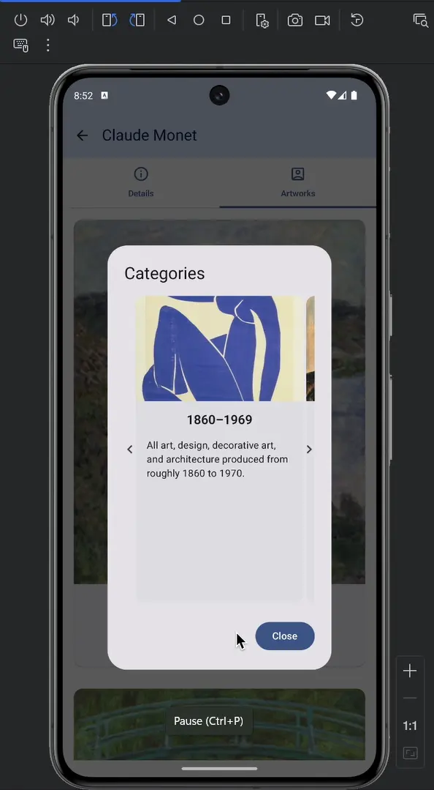

# 🎨 Artify - Android Art Explorer App

[](https://kotlinlang.org/)
[](https://developer.android.com/)
[](https://developer.android.com/jetpack/compose)
[](LICENSE)

A modern Android application built with **Jetpack Compose** that provides an immersive art discovery experience. Users can explore artists, view detailed artwork collections, and manage their personal favorites with a clean, intuitive interface.



## 🌟 Key Highlights

- **Modern Android Development**: Built entirely with Jetpack Compose and Material 3 design system
- **Clean Architecture**: Implements MVVM pattern with proper separation of concerns
- **RESTful API Integration**: Seamless data fetching with Retrofit and OkHttp
- **Image Optimization**: Efficient image loading and caching with Coil
- **Session Management**: Persistent user sessions with cookie management
- **Responsive UI**: Adaptive design supporting multiple screen sizes

## 🛠️ Technical Stack

### Core Technologies
- **Language**: Kotlin
- **UI Framework**: Jetpack Compose
- **Architecture**: MVVM (Model-View-ViewModel)
- **Minimum SDK**: API 24 (Android 7.0)
- **Target SDK**: API 35 (Android 15)

### Libraries & Dependencies
- **Networking**: Retrofit 2.9.0, OkHttp 4.12.0
- **Image Loading**: Coil 2.5.0
- **Navigation**: Navigation Compose 2.7.7
- **Session Management**: PersistentCookieJar 1.0.1
- **UI Components**: Material 3, ConstraintLayout
- **Lifecycle**: ViewModel, LiveData, Lifecycle-aware components

## 🚀 Features

### Core Functionality
- **Artist Discovery**: Search and browse through extensive artist database
- **Artwork Gallery**: High-quality image viewing with detailed metadata
- **Favorites System**: Save and manage personal art collections
- **User Authentication**: Secure login/register with JWT token management
- **Offline Support**: Cached data for seamless offline experience

### UI/UX Features
- **Material 3 Design**: Modern, accessible interface following Google's design guidelines
- **Dark/Light Theme**: Automatic theme switching based on system preferences
- **Smooth Animations**: Fluid transitions and micro-interactions
- **Responsive Layout**: Optimized for phones and tablets
- **Accessibility**: Full support for screen readers and accessibility services

## 📱 Screenshots & Demo


*Screenshot showing the main interface with artist search and artwork display*

## 🏗️ Architecture

### Project Structure
```
ArstyApp/
├── app/
│   ├── src/main/java/com/example/arstyapp/
│   │   ├── data/
│   │   │   ├── model/          # Data models and DTOs
│   │   │   ├── remote/         # API service interfaces
│   │   │   └── repository/     # Data repository implementations
│   │   ├── ui/
│   │   │   ├── components/     # Reusable UI components
│   │   │   ├── screens/        # Screen composables
│   │   │   └── theme/          # Material 3 theming
│   │   ├── viewmodel/          # ViewModels for state management
│   │   └── MainActivity.kt     # Main activity entry point
│   └── build.gradle.kts        # App-level dependencies
└── build.gradle.kts            # Project-level configuration
```

### Design Patterns
- **Repository Pattern**: Centralized data access layer
- **Dependency Injection**: Manual DI for better testability
- **Observer Pattern**: Reactive UI updates with StateFlow
- **Factory Pattern**: Object creation for complex UI components

## 🚀 Getting Started

### Prerequisites
- Android Studio Hedgehog (2023.1.1) or later
- Android SDK API 24+
- Kotlin 1.9.0+
- Gradle 8.0+

### Installation

1. **Clone the repository**
   ```bash
   git clone https://github.com/shettyrohit0810/Android-Art-Explorer-App.git
   cd Android-Art-Explorer-App
   ```

2. **Open in Android Studio**
   - Launch Android Studio
   - Select "Open an existing project"
   - Navigate to the cloned directory
   - Select the `ArstyApp` folder

3. **Build and Run**
   - Connect an Android device or start an emulator
   - Click "Run" or use `Shift + F10`
   - The app will build and install automatically

### Configuration
- Update API endpoints in `NetworkModule.kt` if needed
- Configure signing keys for release builds
- Set up backend API credentials

## 🧪 Testing

### Test Coverage
- **Unit Tests**: ViewModel logic and business rules
- **Integration Tests**: API service and repository layer
- **UI Tests**: Critical user flows and interactions

### Running Tests
```bash
# Run unit tests
./gradlew test

# Run instrumented tests
./gradlew connectedAndroidTest

# Generate test coverage report
./gradlew jacocoTestReport
```

## 📊 Performance Optimizations

- **Image Caching**: Efficient memory management with Coil
- **Network Optimization**: Request/response caching and compression
- **Memory Management**: Proper lifecycle handling and leak prevention
- **Build Optimization**: ProGuard rules for release builds
- **UI Performance**: Lazy loading and efficient recomposition

## 🔧 Development

### Code Style
- Follow Kotlin coding conventions
- Use meaningful variable and function names
- Implement proper error handling
- Write comprehensive documentation

### Git Workflow
```bash
# Create feature branch
git checkout -b feature/new-feature

# Commit changes
git commit -m "feat: add new feature description"

# Push and create PR
git push origin feature/new-feature
```

## 📈 Future Enhancements

- [ ] Advanced search filters and sorting
- [ ] Social features (sharing, comments)
- [ ] AR artwork viewing
- [ ] Offline mode improvements
- [ ] Analytics and user insights
- [ ] Multi-language support

## 🤝 Contributing

Contributions are welcome! Please feel free to submit a Pull Request. For major changes, please open an issue first to discuss what you would like to change.

1. Fork the repository
2. Create your feature branch (`git checkout -b feature/AmazingFeature`)
3. Commit your changes (`git commit -m 'Add some AmazingFeature'`)
4. Push to the branch (`git push origin feature/AmazingFeature`)
5. Open a Pull Request

## 📄 License

This project is licensed under the MIT License - see the [LICENSE](LICENSE) file for details.

## 👨‍💻 Developer

**Sahil Shetty**  
*Android Developer | Mobile App Enthusiast*

- 🌐 **Portfolio**: [GitHub Profile](https://github.com/shettyrohit0810)
- 📧 **Contact**: Available for opportunities
- 💼 **LinkedIn**: [Connect with me](https://linkedin.com/in/sahil-shetty)

---

<div align="center">

**⭐ If you found this project helpful, please give it a star! ⭐**

Made with ❤️ using Jetpack Compose

</div>
